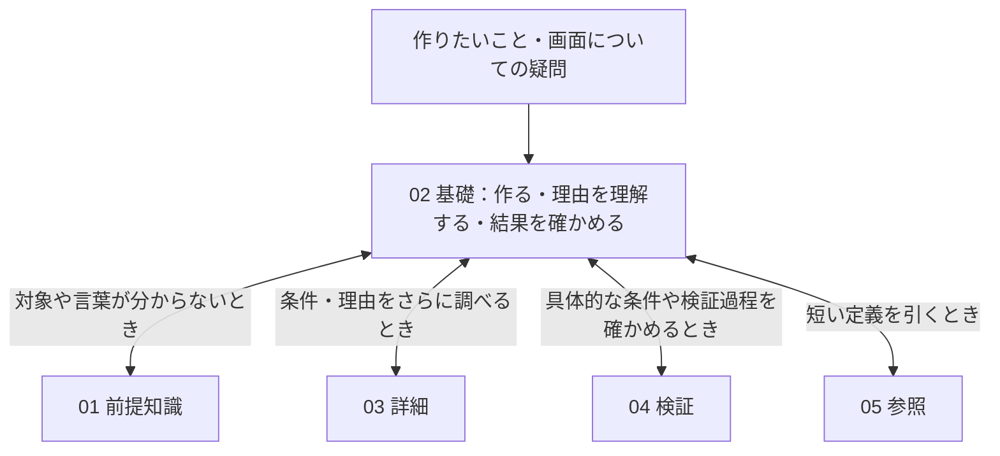

# 基礎整理マップ

> [!NOTE]
> Codex用の内部ルーター。人間向け本文や必読の入口として扱わない。

## 役割

普段の学習・実装で中心に読む知識を置く。基本の仕組み、使いどころ、操作する場所、書く内容、判断と確認をつなぎ、実装手順だけに限定しない。

従来の基礎ノートはこの02へ集約済み。記事内には前提・詳細も混在しており、01・03への個別の抽出・分割はこれから対象を絞って進める。

## 現状の全体像

この地図は、Codexが整理前に「何がどこにあり、どの説明のつながりを保つか」を確認するためのもの。分野名の順序だけから学習経路を決めない。フォルダの所在と本文に確認できた関係を示し、整理案は後段で区別する。

矢印は、説明を調べたり実装へ戻ったりする関係を表す。すべてを順に履修する流れや、ブラウザ内部の処理順ではない。04から一般知識へ反映する条件はAGENTSに従う。保存専用のAI対話ログは、この知識整理の経路に含めない。

現時点では01に説明本文はなく、03にはHTML・CSSのinsetの詳細1本がある。02から前提・詳細を分け終えた状態ではない。最新の移行状況は[CURRENT](../CURRENT.md)で確認する。

## 分野別の入口

分野フォルダは、制作知識 → 設計 → 作業環境・補助 → 素材編集 → Officeの順に探せるよう並べる。学習時に全分野をこの順で履修するという意味ではない。必要な分野から読む。

| 分野番号 | 分野 | 現在の担当・収録状態 | 内部ルーター |
| --- | --- | --- | --- |
| 01 | HTML / CSS | 構造・箱・配置・画像の実装と、表示結果をレンダリングや観測から理解する本文 | [HTML・CSS整理マップ](./01_HTML・CSS/00_HTML・CSS整理マップ.md) |
| 02 | JavaScript | 要素を取得し、状態を読み書きして画面を動かす本文。データ・非同期処理・関数分割も扱う | [JS整理マップ](./02_JS/00_JS整理マップ.md) |
| 03 | TypeScript | 値や関数の型から、ReactのProps・State・Eventの型付けへつなぐ本文 | [TypeScript整理マップ](./03_TypeScript/00_TypeScript整理マップ.md) |
| 04 | React | 画面を部品に分け、Props・State・イベント・データ取得を扱う本文 | [React整理マップ](./04_React/00_React整理マップ.md) |
| 05 | PHP | 変数・条件分岐・繰り返し・関数の本文。WordPress固有機能と分けて確認する | [PHP整理マップ](./05_PHP/00_PHP整理マップ.md) |
| 06 | WordPress | 仕組みを確認する「基礎」と、静的HTMLからテーマを作る「制作」の本文 | [WordPress整理マップ](./06_WordPress/00_WordPress整理マップ.md) |
| 07 | 設計方針 | CSS・JavaScript・WordPressの命名や分割、責務について採用した判断。各言語・実装記事へ戻る接続も持つ | [設計整理マップ](./07_設計/00_設計整理マップ.md) |
| 08 | Git / GitHub | 制作物の履歴・共有・公開確認と、操作時に混同しやすい対象の本文 | [GitHub整理マップ](./08_GitHub/00_GitHub整理マップ.md) |
| 09 | VS Code | 自分の環境で採用した設定・拡張機能・注意点。GitやVimの一般説明と分担する | [vscode整理マップ](./09_vscode/00_vscode整理マップ.md) |
| 10 | Vim / Neovim | 導入とVS Code統合の本文。操作教材の全面的な転載先ではない | [Vim整理マップ](./10_Vim/00_Vim整理マップ.md) |
| 11 | ChatGPT / LLM活用 | 疑問・仮説を整理して根拠確認につなぐ本文と、操作・連携の説明。Wiki全体の運用思想とは分担する | [chatgpt整理マップ](./11_chatgpt/00_chatgpt整理マップ.md) |
| 12 | Illustrator | 素材作成・書き出しの受け皿。現在は整理マップのみ | [Illustrator整理マップ](./12_Illustrator/00_Illustrator整理マップ.md) |
| 13 | Photoshop | 写真・画像編集の受け皿。現在は整理マップのみ | [Photoshop整理マップ](./13_Photoshop/00_Photoshop整理マップ.md) |
| 14 | Excel | 表計算・データ整理の受け皿。現在は整理マップのみで、ChatGPT側の連携記事へ案内がある | [Excel整理マップ](./14_Excel/00_Excel整理マップ.md) |
| 15 | PowerPoint | 資料作成の受け皿。現在は整理マップのみで、ChatGPT側の連携記事へ案内がある | [PowerPoint整理マップ](./15_PowerPoint/00_PowerPoint整理マップ.md) |

## 既存本文から確認できる理解のつながり

下表は、分野マップとリンク先本文の目的・説明・戻り先を照合したもの。本文がその話を扱っていることを確認した地図であり、全記述の技術的な再検証や、本人が実際にたどった学習順の認定ではない。

| 出発点になる疑問・作業 | 既存の説明でつながるところ | 整理時に残す接続 |
| --- | --- | --- |
| 読み込み後や幅変更で画面がずれるのはなぜか | [読み込み後や幅変更で起きる位置ずれ](./01_HTML・CSS/07_ブラウザ挙動とズレ/02_読み込み後や幅変更で起きる位置ずれ.md)で、現象・観測値から原因を考える。画像の対策を試すときは[表示領域を予約する](./01_HTML・CSS/11_メディア設計/04_画像の読み込み前に表示領域を予約する.md)へ戻る | 画面の違い → 観測 → レンダリング・サイズ条件による説明 → 実装で再確認。仕組みへの興味から基本フローへ入る経路も保つ |
| 文字や画像を狙った場所へ置きたい | [箱の中央に文字を重ねる練習](./01_HTML・CSS/11_メディア設計/05_画像の上に文字や部品を重ねる.md#箱の中央に文字を重ねる)から画像への応用へ進み、必要なら[03のinset詳細](../03_詳細/01_HTML・CSS/03_insetで広がる条件を調べる.md)へ分かれる | 最小例 → 箱と中身の区別 → 条件を変えた比較 → 元の実装。練習を理解の再開地点として残す |
| クリックや入力で表示を変えたい | [DOMとイベント](./02_JS/02_DOMとイベント.md)は、HTMLをもとにした対象を取得し、class・属性・文字・状態を変える説明を持つ。[HTMLの土台](./01_HTML・CSS/01_HTMLの土台.md)でもDOMの構造を扱う | HTMLの構造とJSが操作する対象を結ぶ。同じDOMでも「何でできているか」と「どう操作するか」は役割が異なる |
| 画面を部品と状態で扱い、受け渡す値も確認したい | [Reactの土台](./04_React/01_Reactの土台.md)からProps・Stateなどへ進み、[Reactで使うTypeScript](./03_TypeScript/06_Reactで使うTypeScript.md)で型付けを扱う | 部品が受け取るもの・内部で持つものと、その型の説明を結ぶ。JS → TS → Reactの固定履修順としては扱わない |
| 静的なページをWordPressのテーマにしたい | [静的HTMLからWordPress化する流れ](./06_WordPress/制作/06_静的HTMLからWordPress化する流れ.md)がHTML・CSS・BEMからテンプレートへの変換を扱う。PHP文法は[PHPの既存本文](./05_PHP/00_PHP整理マップ.md)へ分担する | 完成させたい表示 → 共通部分・動的部分の見極め → テンプレート化。PHP・WordPress・CSSの分割責務を混ぜない |
| 作れたものを、後から直しやすく管理したい | [設計](./07_設計/00_設計整理マップ.md)は採用した命名・分割方針、[GitHub](./08_GitHub/00_GitHub整理マップ.md)は履歴・共有、[VS Code](./09_vscode/00_vscode整理マップ.md)は作業環境を扱う | 実装の仕組み、採用方針、変更履歴、エディタ補助を分けながら必要時に行き来する |
| 説明が噛み合わず、何を質問・確認すればよいか迷う | [LLMとGPT活用](./11_chatgpt/01_LLMとGPT活用（事実に近づく対話手順）.md)は、つまずきの言語化・前提整理・一次情報確認から実務判断へ戻す流れを持つ | どの技術分野でも使う補助経路。AIとの対話そのものを、確認済みの技術知識と同一視しない |

## 整理案として確かめること

- **今回の試案**：HTML・CSSは「作るための入口」と「表示結果やレンダリングの理由を知る入口」を並行してたどれるようにする。現在の本文に両方の説明はあるが、このまとめ方が本人の感覚と一致するかは未確認。
- **まだ決めていないこと**：記事・節の最終的な読む順、01・03へ分ける具体的な境界、番号変更。上のつながりを、ただちに移動・分割する指示として扱わない。
- **試行中の1件**：[HTML・CSSの配置と並び順](./01_HTML・CSS/00_HTML・CSS整理マップ.md#htmlcss全体の配置と並び順)を15記事の実際の番号へ反映した。05の箱の例から06のDevTools確認へ接続し、05と07の描画フローの往復も保持。本人への適合は未確認で、他の分割・統合は候補のまま。

## 反映前の確認

知識の追加・更新でも、分類と併せて[説明経路の見直し](#知識の追加更新と説明経路の見直し)を行う。

1. [CURRENT](../CURRENT.md)で今回の対象を確認し、主分野を1つ選ぶ。
2. 対応する整理マップから既存正本を探し、役割・重複・不足を照合する。
3. 短い前提・理由・誤用を防ぐ条件は本文に残す。独立した前提説明は[01](../01_前提知識/00_前提知識整理マップ.md)、基本の理解後の掘り下げは[03](../03_詳細/00_詳細整理マップ.md)へつなぐ。
   - [基礎との対応と並び順](../AGENTS.md#基礎との対応と並び順)に従い、01・03との関係は番号一致ではなく相互リンクで示す。必要になる節に読む目的を添え、01・03からもこの基礎へ戻れるようにする。
4. 複数分野にまたがっても主ファイルを1つにし、他方は必要な要点と参照にする。
5. 具体例・案件条件・検証ログは04、短い定義や確認カードは05へ分ける。

## 知識の追加・更新と説明経路の見直し

一度の整理に限らず、知識を後から追加・補足・訂正するときにも使う。既存本文と整理マップを出発点とし、ファイルの境界や読む順を固定された完成形として扱わない。以下を一回の依頼内で進め、途中の発見で説明順・配置を修正する。

1. **疑問と役割を捉える**：何の疑問に答える材料か、何を操作・観測する説明かを確認する。前提・根拠を確認して説明順を仮組みし、実装から入る場合も、仕組みへの興味から入る場合も、対象から理由・実装や確認までのつながりを見る。
2. **関連する本文と照合する**：対象分野の00系から既存正本を探し、追加先の前後の節と、必要な前提・詳細・戻り先を確認する。話題名だけでなく、説明の役割・重複・不足を比べる。短い補足は記事内の確認から始め、前提不足・重複・役割の変化が関連記事に及ぶ場合に確認範囲を広げる。毎回Wiki全体を読み直したり、一括再編したりしない。
3. **配置と組み合わせを選ぶ**：「疑問から説明を経て実装・確認へ進むまとまり」を単位に、既存記事への追記、他記事への移動、統合、分割、新規記事、記事内の順序変更、リンク接続を必要に応じて比較する。役割を果たしている部分はそのまま残す。01・02・03の分類だけで判断を終えず、移動や統合で入口・再開地点が失われないかも見る。
4. **反映して経路を点検する**：本文を作成・修正し、題名と見出し、各節の導入、例から適用範囲までを読み直す。疑問が置き去りにならないか、未説明の前提が増えていないか、必要な説明から実装・観測へ戻れるかを確認する。つながらなければ説明順や配置を組み直す。元の整理案を正解として維持しない。
5. **地図と判断理由を同期する**：記事の役割・配置・接続が変わった場合は、影響する00系の担当・経路・反映先を更新する。移動等に伴う索引・相互リンク・参照元も同じ作業で直す。内容だけの補足で地図の記述が変わらない場合は追記不要。配置や経路を変える際は、現在地・変更先・つなぐ説明・理由・残す入口と戻り先を短く示す。大きめの比較は表、小さな変更は短い記述でよい。

Codexによる経路の点検と、本人に説明が通じたことは区別する。本人の反応がなければ適合は未確認とし、後から分かりにくさが分かった場合は本文と地図を見直す。地図には現在の所在・本文で確認できた関係と、提案中の経路を区別して残す。

これは依頼された範囲で説明を改善する手順であり、採用方針の変更・削除・基盤文書の変更に関する権限を広げない。未確認の知識や判断待ちの材料の扱いはAGENTSに従う。

## 前提・詳細との対応と並び順

01・03は、02を中心に読むための前提・掘り下げとして管理する。番号は並び順、知識の対応は相互リンクで表す。

1. 01・03の本文では、冒頭にどの基礎記事・節を支える説明かを示し、基礎へ戻るリンクを付ける。02の該当節にも、何を確認したいときに読むかを添えてリンクする。
2. 本文は各フォルダ内で `01_テーマ名.md` から連番にし、00は整理マップ等に使う。01・02・03で同じ題材の番号を一致させる必要はない。
3. 01・03は、主に対応する02の分野・記事の順序へできるだけ沿わせる。同じ基礎に対応する説明は、読むための依存関係や用途を見て並べる。
4. 複数の基礎に関係する場合は、説明の主目的に合う基礎を主な戻り先・並びの基準にする。他の基礎へは必要な関連リンクを付け、番号合わせのために本文を複製しない。各分野の00系には主な対応先を示す。
5. 02の番号順を学習順として自動的に正しいと扱わない。既存の並びと本文の役割を確認し、不自然な箇所があれば対象範囲で見直す。番号変更・移動時は整理マップ、相互リンク、参照元を同じ作業で更新する。

分野フォルダの番号と名前は、このページの「分野別の入口」を基準として01・02・03で共通にする。01・03は本文が必要な分野だけ作り、存在しない分野の番号は詰めない。例えばHTML・CSSはどの階層でも `01_HTML・CSS`、JSは `02_JS` とする。分野番号の一致は分類の一致であり、中の記事の一対一対応を表すものではない。

記事を追加するときは、主な基礎との位置関係を見て既存の本文間へ入れる必要があるか確認する。同じ基礎に複数の記事が対応しても、主な基礎順と説明の依存関係で並べられる。名称・番号を変更した場合は、対象分野の一覧と関連リンクを追従させる。

## 更新時の境界

- 一般性を確認した知識を、目的に合う既存本文へ反映する。
- 採用方針は対象分野の説明と混ぜず、設計の該当カテゴリへ分ける。
- 分野フォルダを追加した場合は、この一覧にも内部導線を追加する。
- 振り分けは[学習の優先順位](../AGENTS.md#学習の優先順位で010203へ振り分ける)、本文作成は[説明方針](../AGENTS.md#読者の疑問から説明を組み立てる)に従う。
