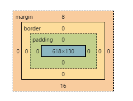

# 01_一つの箱とdisplay

背景色を付けた要素が横へ広がったり、文字の分だけの幅になったりする。これはHTMLのタグ名だけで決まるのではなく、その要素がCSSでどのような箱として扱われるかによって変わる。

このページでは、一つの箱を作り、`display`、幅・高さ、`padding`、`border`、`margin` を画面と対応させる。箱が作られる詳しい工程や、割合指定の基準は必要になったところで別の記事へ進める。

## HTMLとCSSをつないで一つの箱を作る

`index.html` と `css/style.css` を用意する。[最小のHTML文書](../02_HTML文書の骨格/01_最小のHTML文書を作る.md#最小の基本形)を使い、HTMLのCSS読み込み先を `css/style.css` に合わせる。

`body` には次を書く。

```html
<div class="notice">お知らせ</div>
```

`css/style.css` には次を書く。

```css
.notice {
  width: 240px;
  padding: 16px;
  background-color: #dceeff;
  color: #333;
}
```

HTMLの `class="notice"` が対象の目印で、CSSの `.notice` がその要素を選んでいる。保存してブラウザで開くと、薄い青色の背景と内側の余白を持つ「お知らせ」の箱が表示される。

まず `background-color` だけを変え、保存・再読み込みして色の変化を見る。変わらなければ、HTMLに書いたCSSの読み込み先とclass名を確認する。

表示を変えられたら、[DevToolsでその指定を確かめる](../06_CSSカスケードとDevToolsの見方/01_DevToolsで適用されたCSSを確認する.md#作った箱のcssをdevtoolsで確かめる)へ進める。

## 箱の内側と外側を4つに分ける

画面上の箱は、内側から次の領域に分けて確認する。

```text
margin
└─ border
   └─ padding
      └─ content
```

| 領域 | 何がある場所か |
| --- | --- |
| `content` | 文字や画像などの内容 |
| `padding` | 内容と枠線の間 |
| `border` | 箱の枠線 |
| `margin` | ほかの箱との外側の間隔 |

この4領域で箱の寸法を読む考え方がボックスモデルである。

`width: 240px` と `padding: 16px` を指定した先ほどの例では、初期値の `box-sizing: content-box` のままなら、240pxはcontentの幅になる。左右のpaddingが加わるため、borderの外側までの幅は272pxになる。

```text
16px + 240px + 16px = 272px
```

外側までを240pxに収めたい場合は、`box-sizing: border-box` を加える。

```css
.notice {
  box-sizing: border-box;
  width: 240px;
  padding: 16px;
}
```

`box-sizing` は、`width` と `height` が箱のどこまでを含むかを変える。箱の並び方を変える `display` とは役割が違う。

## `block`と`inline`で背景の広がり方を比べる

同じ背景色を付けても、`div` と `span` では最初の見え方が異なる。

```html
<div class="box box--block">A</div>
<span class="box box--inline">B</span>
```

```css
.box {
  background-color: #dff2ff;
}

.box--block {
  display: block;
}

.box--inline {
  display: inline;
}
```

通常フローでは、`block` の箱は利用できる横幅へ広がりやすい。`inline` の箱は文字の流れに入り、横幅は主に内容に沿って決まる。

`display: block` が `width: 100%` を自動で書き足しているわけではない。幅を指定していない通常のブロックは、`width: auto` の規則によって利用できる幅を使う。

一方、通常の非置換要素が作るinline boxでは、`width` や `height` を指定しても通常はその寸法にならない。画像や入力欄など、条件の違う要素は[置換要素](../../../05_参照/置換要素（img・input・video）.md)で確認できる。行の高さや文字の揃い方は[08_インラインと行の仕組み](../08_インラインと行の仕組み/01_文字の行間と高さを確認する.md)で扱う。

## ボックスモデルとbox tree上のboxの関係

HTMLの要素には、`display` などの指定に応じて、配置に使うCSSの箱が生成される。その箱を `content / padding / border / margin` に分けて寸法を読むのがボックスモデルである。

```text
HTMLの要素
→ displayなどに応じて配置用の箱が作られる
→ ボックスモデルで箱の領域と寸法を確認する
```

要素と箱が常に一対一になるとは限らない。箱の種類やbox treeまで調べる場合は、[box treeとボックスモデルの関係](./02_box-treeとボックスモデル.md)へ進む。HTMLとCSSから箱が作られ、LayoutやPaintへ進む全体像は[07の基本フロー](../07_ブラウザ挙動とズレ/01_ブラウザが表示を作る基本フロー.md#基本フロー)で扱う。

## 見えている広さを「余白」と決めつけない

要素が中身より広く見えても、必ずしも `margin` や `padding` が原因とは限らない。

横方向では、次の順に見る。

1. `display` が `block` か
2. 親の幅や列幅が広くないか
3. `width` が指定されていないか
4. `padding`、`border`、`margin` のどこが広いか

縦方向では、次の順に見る。

1. 文字が複数行になっていないか
2. 子要素の高さが積み重なっていないか
3. `line-height` が大きくないか
4. `padding`、`border`、`margin` のどこが広いか

見た目だけで余白の種類を決めず、対象の要素をDevToolsで選んで確認する。

### DevToolsのボックスモデル図で見ている値



中央の `618 × 130` と周囲の数値は、CSSファイルに書いた宣言をそのまま並べたものではない。ブラウザが親の幅、内容、`box-sizing` などを使って計算した、現在の `content / padding / border / margin` の寸法を示している。

```text
CSSに書いた指定
→ どの指定を使うか決まる
→ 配置に使う寸法が決まる
→ DevToolsのボックスモデル図で確認する
```

ここでは「どの領域が何pxか」を画面と対応させればよい。計算値、使用値、Layout、Paintの違いまで必要になったら[07の基本フロー](../07_ブラウザ挙動とズレ/01_ブラウザが表示を作る基本フロー.md#基本フロー)へ進む。

## 箱の大きさが予想と違うときの確認順

1. DevToolsで対象の要素を選ぶ。
2. `display` を確認する。
3. 親と自分の `width`、`height` を確認する。
4. ボックスモデル図で `padding`、`border`、`margin` を分ける。
5. FlexやGridの中なら、親の配置指定を確認する。
6. それでも分からなければ、値の基準やCSSの上書きを調べる。

割合指定で予想と違う場合は、[パーセント指定と包含ブロック](./03_パーセント指定と包含ブロック.md)へ進む。ページ外周や見出しの余白を消したい場合は、[リセットCSSで消す余白を選ぶ](./04_リセットCSSで消す余白を選ぶ.md)で対象を確認する。CSSのどの宣言が使われたか分からない場合は、[06_CSSカスケードとDevToolsの見方](../06_CSSカスケードとDevToolsの見方/01_DevToolsで適用されたCSSを確認する.md)へ進む。

このページを読み終える目安は、一つの要素について「`display`による広がり方」「ボックスモデルのどの領域か」「実際に何pxか」を分けて確認できること。すべてを暗記せず、DevToolsや関連ページへ戻りながら調べられればよい。

## 仕様確認先

- [CSS Display Module Level 3 - Box Layout Modes](https://drafts.csswg.org/css-display-3/#intro)
- [CSS Box Model Module Level 3](https://drafts.csswg.org/css-box-3/)
- [CSS Box Sizing Module Level 4](https://drafts.csswg.org/css-sizing-4/)
