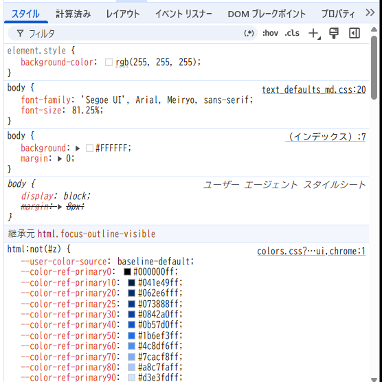

# 01_DevToolsで適用されたCSSを確認する

CSSを書いたのに表示が変わらないときは、コードを眺めるだけで原因を決めず、ブラウザがその要素に使っている宣言を確認する。

このページでは、[一つの箱を作る例](../05_ボックスとdisplay/01_一つの箱とdisplay.md#htmlとcssをつないで一つの箱を作る)を使い、Chrome DevToolsのStylesとComputedを画面上の変化へ結び付ける。複数の宣言が競合する理由は、確認できるようになってから別の記事へ進む。

## 作った箱のCSSをDevToolsで確かめる

Chromeで「お知らせ」を右クリックして「検証」を選ぶ。Elementsで `div.notice` が選ばれていることを確かめる。

1. **書いた指定を探す**：Stylesで `.notice` を探し、`background-color` や `color` と、出典の `style.css` を確認する。CSSが見つからなければ、[HTML側の読み込み](../02_HTML文書の骨格.md#最低限の基本形)と選択した要素を確認する。
2. **一つだけ変える**：Stylesで `color` の値を `tomato` に変え、「お知らせ」の文字色が変わるかを見る。背景や余白はそのままにし、文字色との対応だけを確認する。
3. **結果を見る**：Computedで `color` を探す。色名と別の表記で表示されることもあるため、文字列の一致だけでなく色の結果を確認する。

ここではLocal OverridesやWorkspacesで保存先を接続していない通常の状態を想定する。DevTools内の一時変更だけでは、エディタのCSSファイルへ保存されない。ページを再読み込みして元へ戻し、採用したい変更は `css/style.css` に書いて保存する。

## 最初の確認方法

DevToolsの[Stylesペイン](../../../05_参照/ペイン.md)では、次の順で確認する。

1. Elementsで対象要素を選ぶ。
2. Stylesで確認したいプロパティを探す。
3. 上側にある、打ち消し線のない宣言と出典ファイルを見る。
4. 同じプロパティの打ち消し線、警告アイコン、チェック状態を見る。
5. 最終的な値はComputedで確認する。

```text
上側の規則から有力な宣言を探す
打ち消し線がない宣言 = 現在使われている候補
打ち消し線 = 現在は使われていない印
最終結果 = Computedで確認する
```

上側から探すと早いが、**Stylesの縦位置そのものがCSSの完全な優先順位ではない**。実際の結果は、同じプロパティの打ち消し線とComputedで確かめる。継承された規則は `Inherited from ...` という別の区画にも表示される。

### Stylesペインの画面例



この例では、上から `element.style`、ページ側のCSS、User Agent CSS、継承元の規則が表示されている。User Agent CSSの `margin: 8px` には打ち消し線があり、ページ側の `margin: 0` が使われている。

## Stylesの表示を区別する

| 表示 | 主な意味 |
| --- | --- |
| 打ち消し線 | 現在は使われていない。警告がなければ、まず別の宣言による上書きを疑う |
| 打ち消し線と警告アイコン | プロパティ名や値が無効、またはブラウザが対応していない可能性がある |
| チェックが外れた宣言 | DevTools上で一時的に無効化されている |
| 薄い表示と情報アイコン | 有効なCSSだが、現在の要素や組み合わせでは作用しない場合がある |
| `Inherited from ...` | 親などから継承される規則 |
| Computed | カスケードや継承を解決した後、その要素で使われる値 |

打ち消し線だけでは、「詳細度で負けた」とは限らない。まず、選んだ要素、プロパティ、出典ファイル、最終値を確認する。どの宣言が勝ったかという理由が必要になったら、[記述順と詳細度](./02_同じ条件の記述順と詳細度.md)へ進む。

幅・高さ・余白を図で確認する場合は、[ボックスモデル図で見ている値](../05_ボックスとdisplay/01_一つの箱とdisplay.md#devtoolsのボックスモデル図で見ている値)と分けて考える。

## 次へ進む目安

対象要素、どのファイルの宣言か、画面上の変化、Computedの最終値を結び付けられれば、このページの目的は達成している。

競合があれば[同じ条件の記述順と詳細度](./02_同じ条件の記述順と詳細度.md)、`!important`やレイヤーまで関係する場合は[カスケード全体の優先順位](./03_カスケード全体の優先順位.md)を使う。

## 公式情報

- [Chrome DevTools - CSS features reference](https://developer.chrome.com/docs/devtools/css/reference)
- [Chrome DevTools - Find invalid, overridden, inactive, and other CSS](https://developer.chrome.com/docs/devtools/css/issues)
