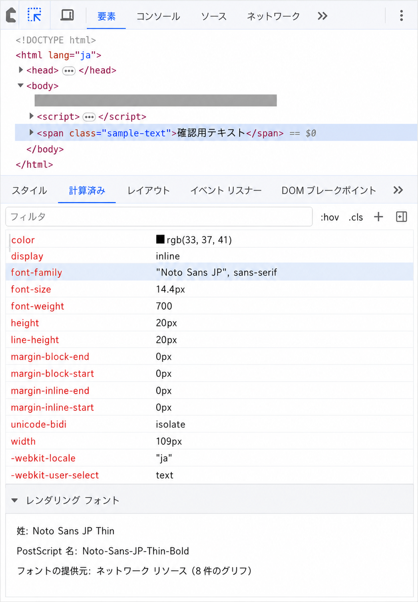

# 04_ブラウザで実際に使われたフォントを確認する

カンプとブラウザで同じ文字列を比べても、フォント指定や端末側のフォント環境が違えば、幅・太さ・高さが変わる。CSSに書いた候補と、実際の描画に使われたフォントを分けて確認する。

## 同じカンプ内でもフォント指定を確認する

同じ作品のカンプでも、テキストレイヤーごとにフォント指定が違うことがある。また、OSやデザインツールによるフォント置換で、同じ文字列でも幅・太さ・高さが変わる。

確認する項目は次のとおり。

1. `font-family`。
2. `font-weight`。
3. `font-size`。
4. `line-height`。
5. 比較中のレイヤーが同じ種類か。
6. フォントの置換が起きていないか。

```css
body {
  font-family: "Hiragino Kaku Gothic ProN", "Hiragino Sans", Meiryo, sans-serif;
}
```

ブラウザは左から順に利用できるフォントを探す。この例ではMacとWindowsで異なる候補が選ばれる可能性があるため、完全に同じ見た目になるとは限らない。カンプへ厳密に合わせる場合は、どのフォントを正とするか決める。

## 指定フォントとレンダリングフォントを分ける

- Stylesの `font-family`：CSSに書かれた候補と宣言の出所。
- Computedの `font-family`：カスケード後に対象要素へ適用される値。
- Computed下部の「レンダリング フォント」：実際の文字描画に使われたフォント。

確認手順は次のとおり。

1. DevTools左上の要素選択アイコンを押す。
2. ページ上で確認したい文字要素を選ぶ。
3. ElementsのComputedを開く。
4. 下まで移動し、「レンダリング フォント」を確認する。



> [!NOTE]
> ページ固有の画像・文言・URLを除き、確認箇所が分かるように加工した説明用画像。実際の画面では、選択した要素やChromeのバージョンによって表示内容が変わる。

```text
CSSのfont-family
→ カスケード後のfont-family
→ 端末で利用できるフォントと収録文字
→ 実際のレンダリングフォント
```

先頭候補が端末にない場合や、そのフォントに対象文字の字形がない場合は、後続候補や別のフォントへフォールバックする。一つの要素内でも、文字によって異なるフォントが使われることがある。

DevToolsの配置は変わることがあるため、画面上の位置ではなく「レンダリング フォント」という項目名で探す。

## 関連ページ

- [カンプとブラウザで測る場所をそろえる](./03_カンプとブラウザで測る場所をそろえる.md)
- [インラインと行の仕組み](../08_インラインと行の仕組み/01_文字の行間と高さを確認する.md)
- [Chrome DevTools - Disable local fonts](https://developer.chrome.com/docs/devtools/rendering/apply-effects/#disable-local-fonts)
